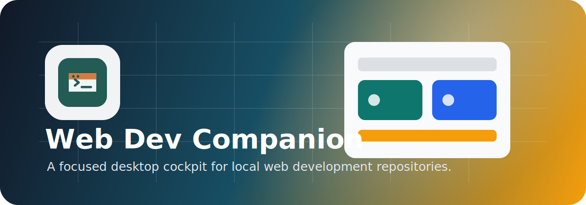

<p align="center">
  
</p>

<p align="center">
  <a href="https://github.com/lextoc/web-dev-companion/releases/tag/v0.1.0-alpha.8"></a>
  <a href="LICENSE"></a>
  <a href="https://www.paypal.com/donate/?hosted_button_id=TAA8FBL4REKV6"></a>
</p>

<p align="center">
  <strong>Ship, inspect, and operate local web projects from one focused desktop cockpit.</strong>
</p>

Web Dev Companion is an Electron, Vue 3, and TypeScript app for keeping local projects in view. It tracks saved repositories, shows Git status and branch details, opens projects in your editor or terminal, and runs project tasks from a focused desktop UI.

## Alpha Release

Latest alpha: `0.1.0-alpha.8`

- macOS: signed and notarized alpha pending.
- [Download for Windows](https://github.com/lextoc/web-dev-companion/releases/download/v0.1.0-alpha.8/Web-Dev-Companion-Windows-0.1.0-alpha.8-Setup.exe)

macOS release artifacts must be signed with a Developer ID Application
certificate and notarized by Apple before they are published.

## Support

Web Dev Companion is free software. If it saves you time and you want to support
ongoing development, donations are welcome:

[](https://www.paypal.com/donate/?hosted_button_id=TAA8FBL4REKV6)

## Features

- Save and browse local Git repositories.
- Scan a parent folder for cloned repositories that have not been saved yet.
- List and clone repositories from your GitHub account through GitHub CLI.
- Search, sort, and pin frequently used repositories.
- Review branch, remote, dirty state, file status details, diffs, and recent commits.
- Stage, unstage, and reset tracked changes, write commits, and inspect commit details from the repository view.
- Sync, switch, create tracking branches from remotes, and remove safe local branches.
- Manage submodule branch links, merge linked parent/submodule branches downward, and remove safe local-only submodule branches.
- Review project health, including Node package checks and detected Java or Ruby task runners.
- Run available health scripts from the health panel or before committing.
- Open repositories in the file manager, configured editor, or terminal.
- Run, pin, monitor, restart, and stop detected project tasks in managed terminals.
- Detect tasks from Node package scripts, Gradle, Maven, Rails, and Rake projects.
- Receive desktop notifications when managed tasks fail or finish after a longer run.
- Auto-refresh repository state, including refresh-on-focus for the active repository.
- Use the command palette, recent commands, keyboard shortcuts, and desktop menu shortcuts for common actions.
- Configure theme, editor command, refresh interval, sync confirmation behavior, and commit celebration effects.

## Branch And Submodule Workflow

The branch management modal keeps repository branch work and submodule branch work together:

- Switch local branches, create local tracking branches from remotes, sync branches, and remove safe local branches.
- Select a submodule and manage saved branch links in a small branch-link modal.
- Link repository branches to their matching submodule branches, for example `release/31 -> mono-31` and `release/32 -> mono-32`.
- When you change the repository merge target, the matching saved submodule target is applied automatically when that branch exists locally.
- Use **Merge down** to switch to the target repository branch and target submodule branch, merge the current repository branch into the target repository branch, merge the current submodule branch into the target submodule branch, and stage the submodule pointer update.
- Clean up unused local-only submodule branches from the same branch management flow. Remote branches are not deleted by this action.

Branch links are persisted in the app state, so the app can remember repository/submodule branch pairs across launches.

## Feature Ideas

The current app already covers the daily repository cockpit: saved projects, Git state, commits, branches, tasks, terminals, pins, and fast navigation. Good next features would deepen that workflow without turning the app into a full IDE.

### High-Impact Additions

- **Workspace groups**: group repositories by client, product, stack, or workflow so the dashboard can switch between focused sets instead of one flat list.
- **Task presets**: save multi-task launch profiles such as `dev + api + storybook` and start or stop them together from the dashboard or command palette.
- **Pull request context**: show the current branch's PR link, review state, checks, and mergeability when the repository has a GitHub remote.
- **Commit assistant**: draft a conventional commit message from staged diffs, with editable suggestions before committing.
- **Cross-repository branch cleanup view**: list stale, merged, gone, or local-only branches across repositories and offer safe cleanup actions.
- **Repository notes**: keep small local notes per repository for setup steps, ports, credentials location, or recurring commands.
- **Port and server monitor**: detect running dev servers, show their local URLs, and open or stop the owning process.

### Nice Quality-of-Life Features

- **Dashboard filters**: add saved filters for dirty repositories, running tasks, branch divergence, package manager, and repo group.
- **Command palette workflows**: support compound commands like opening a repo, starting pinned tasks, and opening the terminal in one action.
- **Recent activity timeline**: show recent commits, task runs, branch checkouts, failed commands, and app actions across repositories.
- **Dependency upgrade lane**: detect package updates and run the relevant check or test script after selected upgrades.
- **Environment file awareness**: flag missing `.env` files from `.env.example` and expose quick open/copy actions.
- **Terminal search and markers**: search task output, jump to errors, and preserve important log markers after a run finishes.
- **Ready-pattern notifications**: let tasks define output patterns that signal when a dev server is ready, then notify or open its local URL.

### Larger Bets

- **Task board for local work**: lightweight per-repository task tracking tied to branches, runnable tasks, notes, and recent commits.
- **Multi-repository operations**: refresh, fetch, install, test, or run tasks across selected repositories with progress and failure summaries.
- **Issue tracker integration**: connect branches and commits to Linear, GitHub Issues, or Jira so local work has product context.
- **AI troubleshooting helper**: summarize failing terminal output and suggest the next command or file to inspect.

## Requirements

- Node.js 20.19.4. Run `nvm use` from the project root if you use nvm.
- pnpm 10.14.0.
- Git available on your `PATH`.
- GitHub CLI authenticated with `gh auth login` to list and clone GitHub repositories.

## Setup

```sh
pnpm install
```

This project allows pnpm to run the install scripts required by Electron and
Vite's esbuild dependency. If Electron was installed before that setting was
present and `pnpm run dev` reports that Electron failed to install correctly,
run:

```sh
pnpm rebuild electron
```

## Development

```sh
pnpm run dev
```

The app stores saved repositories, pinned tasks, settings, recent commands, and repository/submodule branch links in Electron's per-user app data directory.

## Verification

```sh
pnpm test
```

The test command runs the Vue TypeScript checker and the Vitest component test suite.

## Build

```sh
pnpm run build
```

Local builds are packaged without macOS code signing, so a development machine's
personal or expired Apple certificates do not affect `pnpm run build`.

macOS release builds are different: `pnpm run release:alpha` and
`pnpm run release:alpha:mac` run a preflight check and require a valid Developer
ID Application certificate plus Apple notarization credentials. Provide either a
certificate file through `CSC_LINK` and `CSC_KEY_PASSWORD`, or install the
certificate in the local keychain. For notarization, provide
`APPLE_API_KEY`/`APPLE_API_KEY_ID`/`APPLE_API_ISSUER`, or a notarytool keychain
profile through `APPLE_KEYCHAIN_PROFILE`.

Release helpers are also available:

```sh
pnpm run release:alpha
pnpm run release:alpha:mac
pnpm run release:alpha:win
```

Generated build output is intentionally ignored by Git. Commit source files, configuration, lockfiles, and assets instead. Release builds also generate updater metadata such as `latest.yml`, `latest-mac.yml`, or prerelease channel equivalents; upload those files with the installer artifacts.

## Release Flow

Use this flow when preparing another alpha release:

1. Start from a clean `main` branch that is up to date with `origin/main`.
2. Bump the prerelease version in `package.json`, for example from `0.1.0-alpha.1` to `0.1.0-alpha.2`.
3. Update the README download links to the new tag and generated artifact names, using the final asset names reported by GitHub. Only link macOS artifacts after they are signed and notarized.
4. Confirm macOS signing and notarization credentials are available.
5. Run `pnpm test`.
6. Run the relevant release build:
   - `pnpm run release:alpha` for macOS and Windows x64 artifacts.
   - `pnpm run release:alpha:mac` for only the macOS artifact.
   - `pnpm run release:alpha:win` for only the Windows x64 artifact.
7. Review `git status`, then commit the version and documentation changes.
8. Create a matching Git tag named `v<version>`, for example `v0.1.0-alpha.2`.
9. Push the branch and tag with `git push origin main` and `git push origin v<version>`.
10. Create or update the GitHub prerelease for that tag and upload the generated macOS and Windows artifacts, including the updater metadata files and blockmap files.

The release artifacts are written to `release/<version>/` and are not committed.

## Publishing To GitHub

Before pushing a new remote:

1. Review `git status` and make sure only intended source changes are staged.
2. Run `pnpm test`.
3. Add a remote with `git remote add origin <repo-url>`.
4. Push the current branch with `git push -u origin <branch-name>`.

## Contributing

Web Dev Companion is free to use, modify, and share under the MIT license. Pull
requests that improve the app, fix bugs, refine documentation, or expand useful
local development workflows are welcome.

Before opening a pull request, keep the change focused, avoid committing
generated build output or private local configuration, and run:

```sh
pnpm test
```

## License

MIT. See [LICENSE](LICENSE) for details.
